<h3 align="center">Software Engineering & CS student @ Tecnológico de Monterrey 🇲🇽</h3>

  

---

### 🚀 About Me

- 🎓 Studying **Software Engineering & Computer Science** at **Tec de Monterrey**
- 🧑‍🏫 Volunteered as staff at the **Patrones Hermosos** STEM camp
- 💻 I like building and shipping full-stack web apps end to end — frontend, backend, and deployment
- 🌱 Currently exploring new stacks and leveling up my web dev skills
- 📫 Reach me on the links below!

---

### 🛠️ Featured Projects

<table>
  <tr>
    <td width="33%">
      <h4>🏈 kickoff.click</h4>
      
Real-time NFL scores, standings, schedules & news platform. Built backend API integrations and shipped it live.

      <a href="https://kickoff.click">kickoff.click →</a>
    </td>
    <td width="33%">
      <h4>🏆 NFL Playoff Bracket</h4>
      
Bracket prediction pool for the 2025–26 NFL playoffs — layout, scoring logic, and an admin dashboard, hosted on Vercel.

    </td>
    <td width="33%">
      <h4>⚽ WorldCupSwap</h4>
      
App for tracking and trading 2026 World Cup sticker albums. Built with Firebase + Vercel — UI, responsive design, and auth.

    </td>
  </tr>
</table>

---

### 📊 GitHub Stats

  

  

---

### 🔗 Connect With Me

  
  
  

  

